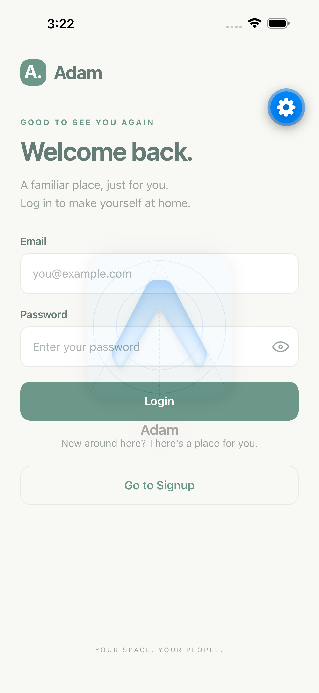
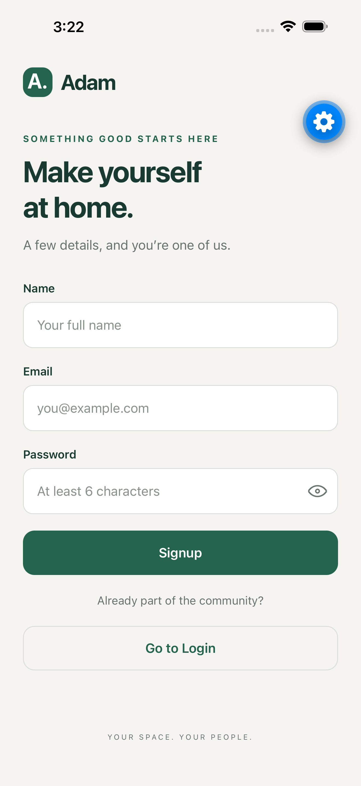
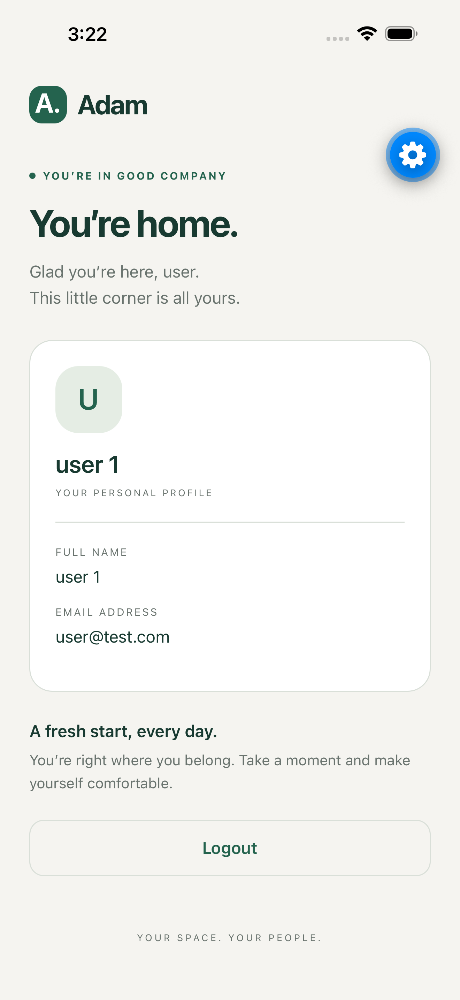

# Adam

A React Native app with signup, login, and logout. Built with Expo, TypeScript,
React Context, and React Navigation.

## Getting started

Use Node.js 24 and npm. For iOS, install Xcode and a simulator runtime. For Android,
set up an emulator in Android Studio or connect a device.

```sh
nvm use
npm ci
npm run ios
```

Run `npm run android` for Android. To use a physical device, run `npm start` and
open the QR code in Expo Go compatible with SDK 57. Keep the development server
running. From that terminal, `i` opens iOS and `a` opens Android.

There are no API keys or seeded accounts. Choose **Go to Signup** to create an
account. Sample details: `user 1`, `user@test.com`, and `secret123`.

## Features

- Signup with name, email, and a password of at least six characters.
- Login with field validation and incorrect-credentials messages.
- Home with the current user's name and email.
- Shared authentication state through `AuthContext`.
- Navigation that removes authenticated screens after logout.
- Session restoration with AsyncStorage.
- Password visibility controls on both forms.
- Accessible labels, loading indicators, and keyboard-aware forms.

## Authentication

The account service is an in-memory mock. It normalizes email addresses, rejects
duplicate accounts, and compares passwords exactly. Passwords remain in memory;
the public user object and AsyncStorage contain only the profile.

**Accounts reset when the app reloads or restarts.** A saved profile can restore
Home, but after logging out you must sign up again. Signup → logout → login works
within the same running app.

The saved profile demonstrates session persistence; it is not a server-verified
session. Production authentication would require a backend and appropriate token
storage. Use test credentials only.

Invalid saved data is discarded. Failed session writes show a warning without
blocking sign-in. If clearing storage fails, logout stays on Home with a retryable
error instead of leaving an old session behind silently.

## Structure

```text
App.tsx          Application providers and navigator
src/auth/        Context, mock account service, validation, session storage
src/navigation/  Typed routes and conditional navigation
src/screens/     Login, Signup, Home
src/components/  Shared layout, fields, buttons, password icon
src/theme/       Colors and text styles
tests/           Service, context, screen-flow, and persistence tests
.maestro/        iOS simulator UI test
```

Screens manage form values and errors. The context manages the signed-in user and
async operations. The account service and storage adapter are separate from the UI.

## Checks

```sh
npm run check
npm test
npx expo-doctor
npx expo export --platform ios --platform android
```

`npm run check` runs TypeScript, ESLint, and formatting checks. Use `npm run format`
to format files. The test suite covers validation, duplicate accounts, credential
errors, signup/logout/login, session restoration, storage failures, and password
visibility.

The simulator flow is in [`.maestro/auth.yaml`](.maestro/auth.yaml). See the
[demo guide](docs/DEMO.md) for instructions. Android bundles have been checked;
Android device testing is still pending.

The dependency audit reports moderate findings in Expo's transitive `xcode` / `uuid`
tooling chain. The suggested automatic fix downgrades Expo and has not been applied.

## Screenshots

| Login                                | Signup                                 | Home                               |
| ------------------------------------ | -------------------------------------- | ---------------------------------- |
|  |  |  |

[Required-field validation](docs/screenshots/validation.png) ·
[Incorrect credentials](docs/screenshots/incorrect-credentials.png)

Captured in the iOS simulator using Expo Go. Its floating blue developer button
is not part of the app's release UI.
